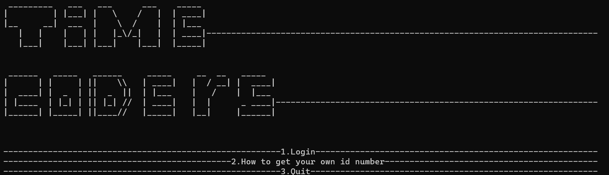
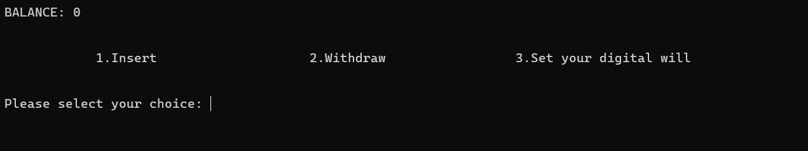

<h1 align="center">Time Coders</h1>

<p align = "center">
 
</p>

<br>

<p align = "center">
  
  
  
  
</p> 

## 📋 Description
Our idea was to create an application that would help make a will easier digitally, as our users would be able to bequeath any material benefits.

## 🚀 Languages and Libraries
<p align="left">
  <a href="https://www.cplusplus.com/"></a>
  <a href="https://www.python.org/"></a> 

</p>

## 🗂 Used technologies
<p align="left">
  <a href="https://visualstudio.microsoft.com/"></a>
  <a href="https://code.visualstudio.com/"></a>
  <a href="https://www.microsoft.com/en-ww/microsoft-365/word"></a>
  <a href="https://www.microsoft.com/en-us/microsoft-365/powerpoint"></a>
  <a href="https://www.adobe.com/"></a>
  <a href="https://git-scm.com/"></a>
  <a href="https://git-scm.com/"></a>
</p> 

## 📝 Documents
 
<h4>Documents</h4>
  <ul>
    <li><a href="My-Digital-Will-Project/Documentation/Time_Coders_documentation.docx">Documentation</a></li>
  </ul> 
<h4>Presenting</h4>
  <ul>    
    <li><a href="My-Digital-Will-Project/Documentation/Time Coders_presentation .pptx">Presentation</a></li>
  </ul> 
   


## 📥 Installation
```
You can download our project by using the green "Code" button.

Or by pasting the following code in your CMD: https://github.com/MIGanev21/Time-Coders.git

```

## ⚙ Repository Access

*You can access our repository by pasting this link into your browser.*
```
 https://github.com/MIGanev21/Time-Coders.git
```

## 👨🏻‍💻 Team Members

| **Name** | **Role** | **Grade** |
| :---:   | :---: | :---: |
| Miroslav Ganev | *Scrum trainer* | 🟨 10A |
| Lazar Apostolov | *Back-end developer*  | 🟥 10B |
| Georgi Ivanov | *Back-end developer*  | 🟩 10V |
| Stelian Nikolov |  *Front-end developer*  | 🟦 10G |


## 



